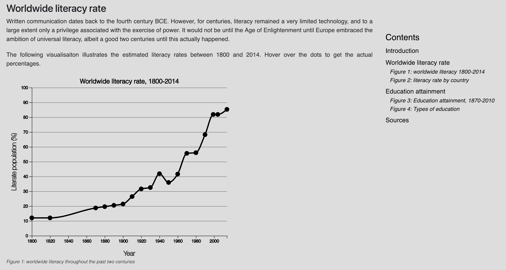
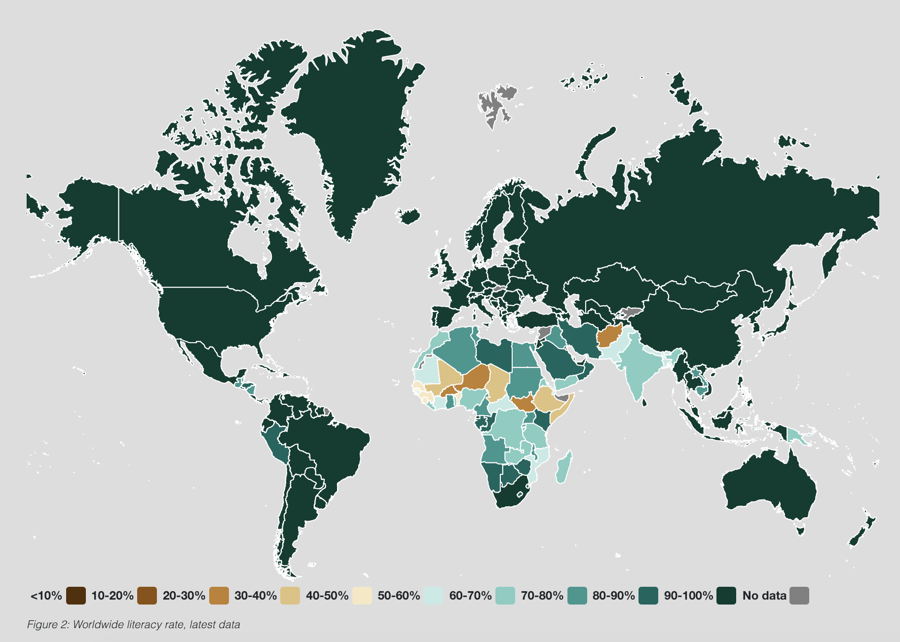
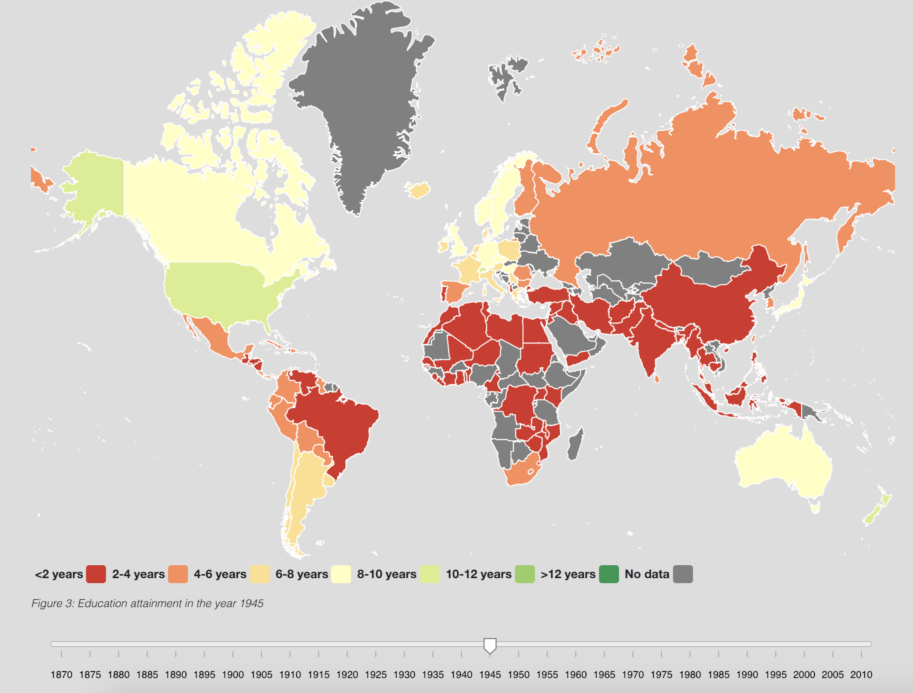
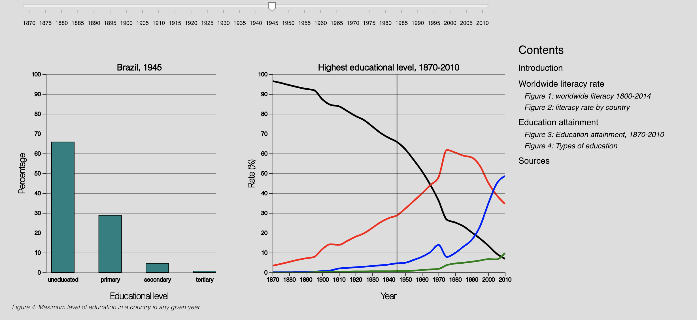

# Educational inequality throughout the world, 1800-2014
Tobias Maätita (10730109)  
Minor Programmeren, Final Project (Winter 2019)

## Purpose
Nowadays, education is widely regarded as a human right. It is expected of governments to provide its citizens with accessible education, whereas citizens are expected to attain a certain level of education. However, educational inequality still exists in the world of today. My final project illustrates the educational inequality throughout the years, by first exploring the worldwide literacy rate and mirroring it to the highest level of education in a country.

#### Screenshots
The webpage can be found [here](https://tobiasmaatita.github.io/project/).
Some screenshots of the page:  

  

#### Repository Contents
All the used data can be found in the [data](https://github.com/tobiasmaatita/project/tree/master/Data) folder. The .csv files contain the raw data, whereas the .json files contain the processed data used for the visualisations. The [doc](https://github.com/tobiasmaatita/project/tree/master/doc) folder contains all pictures used in this repository. The code can be found in the [scripts](https://github.com/tobiasmaatita/project/tree/master/scripts) folder.
This folder contains the following:
* D3 folder, holding all the D3 scripts needed for the visualisations;
* Static folder, holding the CSS stylesheet.
* converter.py, a program that converts .csv files to .json files. This program needs some small modifications to fit the input file.
* .js scripts. These scripts hold the contents of the site. Each script represents a different visualisation or layout.

## Acknowledgements
The content of the site was based on [this](https://ourworldindata.org/global-rise-of-education) investigative piece by Max Roser and Esteban Ortiz-Ospina. The data used for the visualisation can be found on the [UNESCO site](http://data.uis.unesco.org/index.aspx?queryid=166&lang=en) and on the site accompanying [this](https://econpapers.repec.org/article/eeedeveco/v_3a122_3ay_3a2016_3ai_3ac_3ap_3a147-169.htm) research report by Lee and Lee (2016). The data can be found [here](http://www.barrolee.com/Lee_Lee_LRdata_dn.htm).  
To make the data maps, I used the [Datamaps repository](http://datamaps.github.io) from GitHub. The slider was made using [this block](https://bl.ocks.org/johnwalley/e1d256b81e51da68f7feb632a53c3518) by John Walley.

## Copyright
This is a public domain release. Feel free to use any code from this repository. Please can consult the [license](https://github.com/tobiasmaatita/project/blob/master/LICENSE) for further information.
