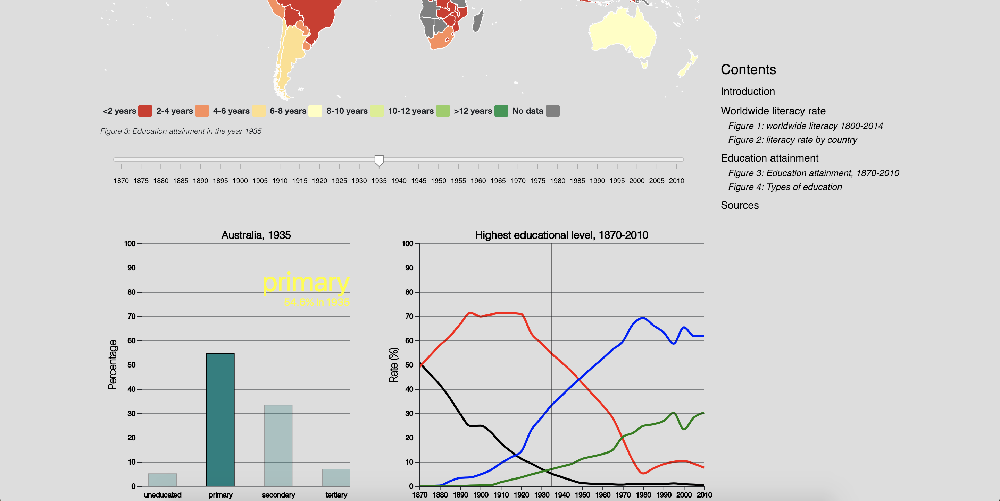

# Final report
Tobias Maätita // 10730109 // Programmeerproject (Winter 2019)

### Description
This website visualises the global trends in literacy and educational attainment. To do so, firstly the worldwide literacy rate is examined. Thereafter, the developments in educational attainment, expressed in the highest educational level achieved by a certain rate of the population, are illustrated. The educational attainment can be examined per country, per five years, and per educational level. The following screenshot gives an impression of this closer examination.

### Technical design
The webpage consists of five figures: two datamaps, one single-linechart and one multiple linechart, and one barchart. Clicking on a country in one of the maps will show the specific information of that country in a barchart and a multiple linechart. Hovering the bars in the barchart will highlight the corresponding line in the linechart. Clicking the bar will isolate the corresponding line. Hovering a line in the linechart will highlight the corresponding bar in the barchart and provide the user of some more specific information. Changing the position of the slider will update the barchart and linechart.  
The four different types of visualisations are each represented in separate scripts: barchart.js, literacy.js (the single-linechart), maps.js, and multipleLines.js. I will now explain in more detail the several modules and their functions, followed by a brief summary of the interactivity between my visualisations.

#### layout.js
The layout of the page is represented in the layout.js script, which only consists of d3 methods to append the divs that hold separate sections of the webpage.

#### main.js
The main.js script loads when the webpage is loaded. It uses the `Promise.all()` function to load in the needed data. Then, using the `addCountryCodes()`, the `fillkeysLiteracy()`, and `fillkeysAttainment()` functions from the `maps.js` script are used to do some final preprocessing of the datasets that are needed for the datamaps. Thereafter, it calls the needed visualisations, thus setting into motion the loading of the entire webpage.

#### literacy.js
The literacy.js script holds the code for the first visualisation, being the linechart on the worldwide literacy rate throughout the years. The main function in this script is the `linechart()` function, which takes the needed data, the given margins and the svg's width and height and finally produces a linechart. This function calls, in order, the `lineScales()` function to make the scales functions conform the entered data, the `lineAxes()` function to make the axes functions given the newly generated scales, the `lineText()` function to provide the axes with text, the `gridLine()` function to draw horizontal gridlines on the graph, and the `dots()` function, which draws dots on each datapoint. Furthermore, the graph has a tooltip which allows the user to get the exact numbers on each datapoint.

#### maps.js
Within this script, both datamaps are drawn. This script contains several functions, which will be described separately.  
The `literacyMap()` function takes the data on worldwide literacy and draws a datamap. It does not call any other functions from this module.  
The `attainmentMap()` function takes the data on worldwide educational attainment throughout the years and draws a datamap. Before drawing, the `slider()` function is called to draw a slider using the years of which there is data. Then it draws the map. When setting the actions to perform when a country is clicked, this function calls a lot of functions from other modules.  
The `slider()` function draws a slider on the webpage. On change, the slider activates the `updateMap()` function. Also, when the barchart and the multiple linechart are active, the slider calls the `updateBar()` and the `updateLines()` functions from the other modules.  
The `updateMap()` takes the data and the selected year and updates the colors of the country in the map. To do so, it calls the `colorFill()` function.  
The `colorFill()` function calculates the range in which the data lies and assigns a color to the country in the attainment map.  
The `fillkeysLiteracy()` and the `fillkeysAttainment()` functions both calculate the range in which the data lies and assigns a color to the country in the literacy, respectively the attainment data. In the case of the attainment map, these fillkeys only set the default colours. The `colorFill()` function changes these later on. These functions are called from the `main.js` module.  
Finally, the `addCountryCodes()` function pairs the countries from the entered dataset to their corresponding country codes. This function is called from the `main.js` module.

#### barchart.js
Within this script, the barchart is drawn upon clicking a country in the educational attainment datamap. This script contains several functions, which will be described separately.  
The `barchart()` function is the main function of this module. This function is called from the `maps.js` module: both the `slider()` function as well as the `attainmentMap()` function call this function. In turn, this function calls a lot of functions from this module. The function draws a barchart from the entered data. Like the linechart, this function calls functions to make scales (`barScales()`), axes (`barAxes()`), gridlines (`gridLine()` from the `literacy.js` module) and text (`axesText()`). This function uses several global variables. First, the `CLICKED` variable, which is a boolean indicating whether a line has been singled out by clicking a bar in the barchart. Second, the `SELECTED` variable keeps track of the lines that have been singled out. Upon clicking a bar in the barchart, this function also calls the `resetButton()` and the `removeReset()` functions from the `multipleLines.js` module in order to make and remove the reset button.  
The `updateBar()` function is called from the `slider()` function and the `attainmentMap()` function from the `maps.js` module. This function, in turn, calls the `barchart()` function to make a newly updated barchart with the new data. This can be data from another year or another country. To update the bar, a year is needed. For this purpose, this function uses the global `CURRENT_YEAR` variable.  
Finally, the `noBars()` function is called from the `attainmentMap()` function from the `maps.js` module. This function shows that there is no data for a chosen country.

#### multipleLines.js
Within this script, the multiple linechart is drawn upon clicking a country in the educational attainment map. This script contains several functions, each of which will be described separately.
The `multipleLine()` function is the main function of this module. This function is called from the `maps.js` module upon: both the `slider()` function as well as the `attainmentMap()` function call this function. In turn this function calls many of the other functions within this module. The function draws a multiple linechart from the entered data. Like the previous drawing functions, this function calls functions to make scales (`lineScales()` from the `literacy.js` module), axes (`axesLines()`), gridlines (`gridLine()` from `literacy.js`) and text (`linesText()`). This function uses the global variable `CURRENT_YEAR` to make sure that it uses the same year as the datamap and the barchart.  
The `getDatasetLines()` function is called from `multipleLines()`. This function converts the dataset on educational attainment to a dataset that can be used to draw multiple lines.  
The `linesLines()` function is called from `multipleLines()`. This function makes four different lines to be drawn later on in `multipleLines()`.  
The `noLines()` function is called from `attainmentMap()` in the `maps.js` module. This function shows that there is no data for a chosen country.  
The `updateLines()` function is called from the `slider()` function in the `maps.js` module. This function updates the position of the indicator line in the chart. This function uses the global variable `CURRENT_YEAR` to make sure that it uses the same year as the datamap and the barchart.  
The `resetButton()` function is called from `barchart()` in the `barchart.js` module. This function sets a reset button. This function uses the global variables `SELECTED` and `CLICKED`. Clicking the button resets both of these global variables to their default values.  
The `removeReset()` function is called from `resetButton()`. This function also resets the global variables `SELECTED` and `CLICKED` to their default values.

#### Interaction summary
A quick summary of the interactivity between my visualisations, whilst omitting naming all the used functions over and over:
* Global variables `SELECTED`, `CLICKED` and `CURRENT_YEAR` are used to ensure that all visualisations use the same information and behave according to the actions of the user.
* Hovering the barchart's bars highlights the corresponding line in the multiple linechart.
* Clicking the barchart's bars isolates the corresponding line in the multiple linechart, using the global variables `SELECTED` and `CLICKED`, and makes a reset button appear.
* Clicking the reset button will make it disappear, will reset the values of `SELECTED` and `CLICKED`, and will bring back all the lines in the multiple linechart.
* Hovering the lines in the multiple linechart will highlight the corresponding bar and use the name of that bar and the global variable `CURRENT_YEAR` to provide the user of the correct information.
* Changing the position of the slider will change the value of the global variable `CURRENT_YEAR` and will use this value to update the barchart and the multiple linechart.

### Challenges and changes
The most challenging part was the interaction between the attainment map, the barchart and the multiple linechart. I wanted the slider to update all three figures, but it proved difficult to pass the right year on to the other functions - that is, making sure that all functions used the right year. To this end, I decided to make a global variable `CURRENT_YEAR` that was continuously being updated.  
Other challenges include passing the right information on the the map while scrolling the slider and updating the charts on clicking a country, but I did not have too much trouble resolving any issues there. I also had some difficulties with the layout, but I believe that these were all resolved.  
My greatest issue was with the legends of the datamaps. I had continuous data, which is represented within a colorscheme on the map. However, the legend that accompanies the map by default is better suited for categorical data. I wanted a continuous legend. However, I did not have the legend as I wanted it in time, so I decided to leave the legend as it is. Instead of a continuous colorscale, I wrote a function to make the data fit into categories that fitted the legend neatly.

When comparing my design document to the final product, it seems that I have not changed an awful lot. The biggest change is that I added a fourth type of visualisation. Firstly, I changed the order in which I presented the visualisations: first opening with a linegraph instead of a worldmap.
At first, I did not intend to make a multiple linechart. I wanted to include a scatterplot to try and find a correlational relationship. However, my data was not suited for a scatterlpot. Therefore, I decided upon a multiple linechart and a barchart to give the user the possibility to zoom in (using the barchart) on a specific moment whilst being able to see its place in a larger frame (using the linechart).  
I also doubted whether a barchart was the right way to show the several educational levels. In my design, I figured a barchart was the right way to go. However, along the way, I considered using a stacked barchart that included multiple countries in order to compare them. However, I eventually decided to add a second chart, rather than comparing side to side.  

### Decisions defense
I chose to use a multiple linechart to intergrate some added interaction between visualisations. Moreover, the data I had was not suited for a scatterplot, which I initially wanted. Secondly, I chose to display the worldmaps in a mercator projection, because it is easier to select countries this way - although the projection is not realistic. First, I used colorschemes in the map that consisted of various shades of the same colors. However, I chose to change the colorschemes to scales that were built up from multiple colors, to accentuate the big differences (between for example a 10% literacy rate and a 100% literacy rate). The background color is set to a light grey, to prevent the user's eyes from tiring. I also chose to change the order in which I presented the visualisations. At first, I wanted to open with a world map on literacy, but I chose to start with the linechart. In my opinion, this better suited the story that I wanted to tell: the linechart makes clear that there is still not a 100% literacy rate worldwide, whereas the datamap on literacy visually shows this fact.
